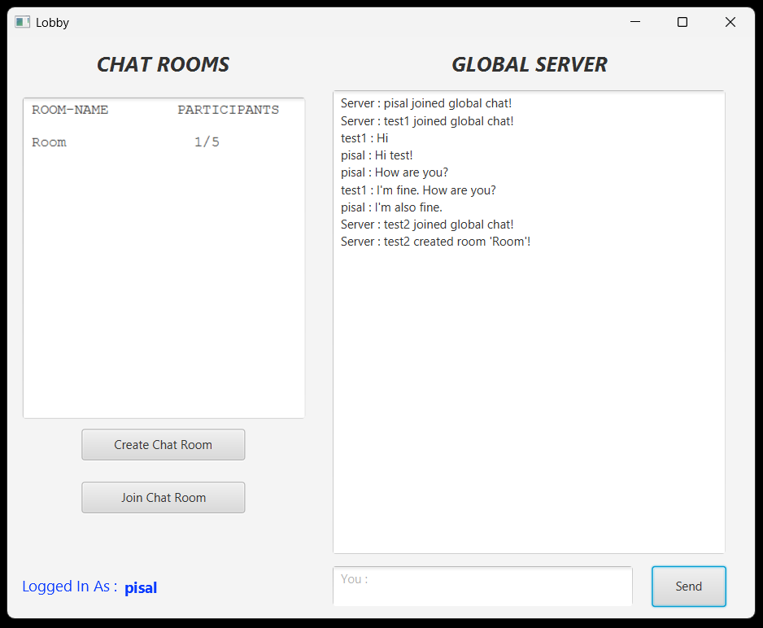
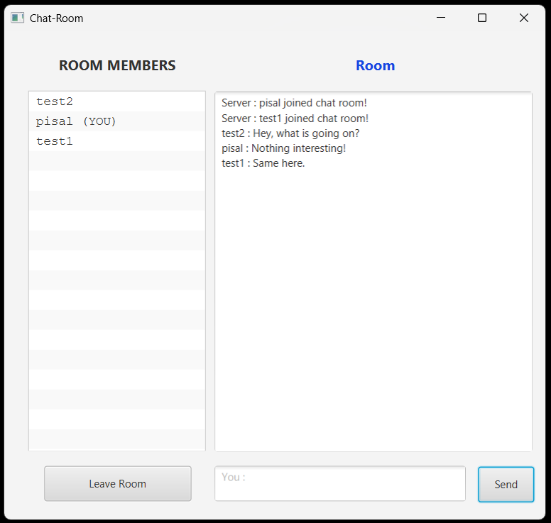

# LAN Chat App

A simple LAN-based Java chat application for real-time messaging on the same network.

This project demonstrates basic socket programming in Java, with a minimal user interface and straightforward setup — ideal for learning or experimenting with networked applications.

---

## 🚀 Overview

This application allows users on the same local area network (LAN) to communicate by sending and receiving messages through socket connections. The focus is on simplicity and clarity rather than full feature completeness.

---

## 📦 Features

- Real-time text messaging over LAN
- Server-client architecture
- Lightweight and minimal dependencies
- Easy to run and test locally

---

## 🖼 Screenshots

### 🗨 Lobby / Global Chat Server


### 💬 Chat Room



---

## 📌 How to Run

1. Clone the repository:
   ```bash
   git clone https://github.com/Devashish-Pisal/lan-chat-app.git
   ```
2. Navigate into the project:
   ```bash
   cd lan-chat-app
   ```
3. Build using Maven:
   ```bash
   mvn clean install
   ```
4. Run the server:
   ```bash
   com.lanchatapp.lanchatapp/Server/Servre.java
   ```
5. Run one or more clients:
   ```bash
   com.lanchatapp.lanchatapp/StartClient.java
   ```


---

## 🛠 How It Works

- One instance acts as a **server**, listening for incoming client connections.
- Other instances act as **clients**, sending messages to the server.
- The server broadcasts received messages to all connected clients.
- All communication happens over TCP sockets.

---

## 📌 Notes

- Make sure all users are on the **same LAN**.
- SQLite database on server.
- Ports and configuration can be updated in code as needed.

---
